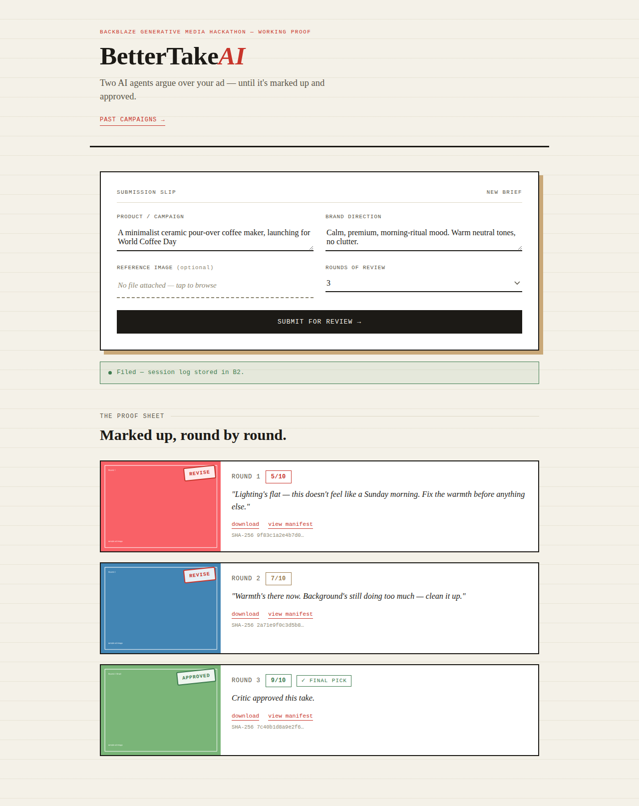
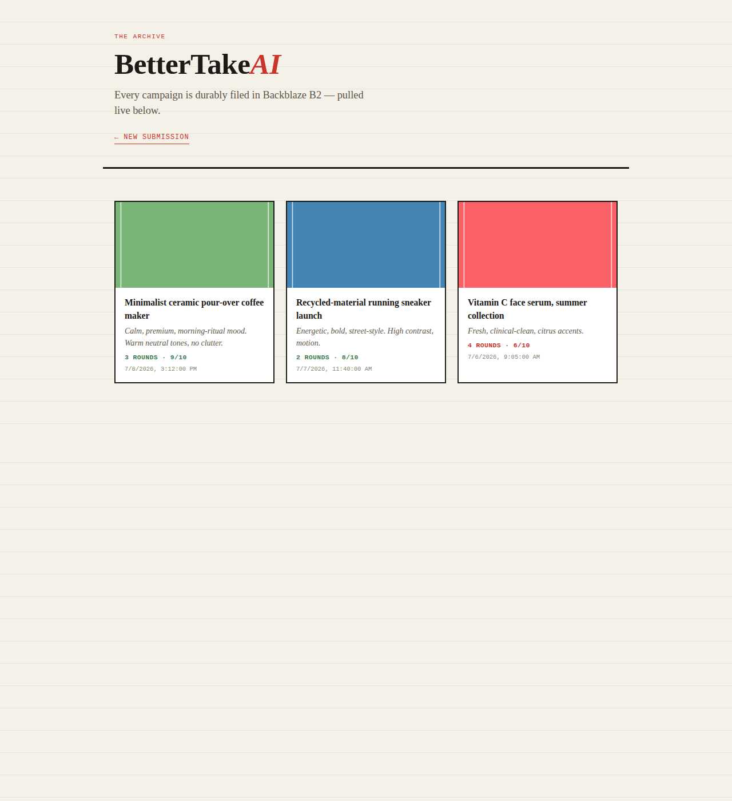

# BetterTake AI

### AI-Powered Multi-Agent Ad Creative Generation & Review

Built for the Backblaze Generative Media Hackathon








---

# Demo

- **Live Application:** https://bettertake-ai.onrender.com
- **Demo Video:**
- **History Page:** https://bettertake-ai.onrender.com/history

---

# Project Description

Creating high-quality advertising creatives usually requires multiple design iterations and human feedback. Traditional AI image generators produce a single image from a prompt, leaving users to manually refine prompts until the result is acceptable.

**BetterTake AI** introduces a collaborative multi-agent workflow where two AI agents iteratively improve an advertisement. A **Generator Agent** creates an ad image from a campaign brief using **Replicate FLUX 1.1 Pro** orchestrated through **Genblaze**, while a **Critic Agent** powered by **Groq Vision** evaluates the generated image, scores it, and identifies one concrete improvement.

Rather than generating a single image, BetterTake AI creates an AI-to-AI creative discussion. Every round is streamed live to the browser and permanently stored in **Backblaze B2**, allowing users to revisit every iteration of every campaign — not just the final result.

---

# The Problem

Marketing teams, startups, and ecommerce businesses frequently need advertising creatives but often face:

- Slow creative iteration
- Repeated prompt experimentation
- No structured AI feedback
- Lost intermediate versions
- Limited transparency into AI decision-making

---

# Our Solution

BetterTake AI combines AI image generation, vision-based evaluation, durable cloud storage, and live streaming into one workflow.

For every campaign:

- Generates an advertisement from a product brief
- Reviews the generated image using an AI vision critic
- Identifies one specific improvement
- Regenerates the advertisement using that feedback
- Repeats for multiple rounds
- Stores every image and critique permanently — approved or not

---

# Multi-Agent Architecture

- **Generator Agent**
  - Replicate FLUX 1.1 Pro
  - Orchestrated with Genblaze
  - Produces advertisement creatives

- **Critic Agent**
  - Groq Vision model
  - Evaluates the generated image
  - Assigns a score
  - Suggests one improvement

---

# Solution Architecture

```text
Campaign Brief
      │
      ▼
Generator Agent (Replicate + Genblaze)
      │
      ▼
Generated Advertisement ──────────────► Stored in Backblaze B2 (every round)
      │
      ▼
Critic Agent (Groq Vision)
      │
 Approved or max rounds reached? ── Yes ─────► Session log finalized in B2
      │
      No
      ▼
One Specific Improvement
      │
      ▼
Generator Creates New Version
      │
      └────────────── Loop
```

Every round's image and manifest are stored the moment they're generated — not only the final approved one. The loop just decides when to *stop* generating new rounds.

---

# AI Workflow

1. User submits campaign brief.
2. Generator creates advertisement.
3. Image streams live to browser.
4. Critic analyzes image.
5. Critic returns score and one improvement.
6. Round's image + manifest saved to B2.
7. If not approved and rounds remain, Generator revises image.
8. Session history becomes available through the History page.

---

# How Genblaze is Used

Genblaze orchestrates the generation pipeline via `Pipeline`/`.step()`, links each generation round to the previous one with `.from_result()`, manages pipeline execution, and stores provenance manifests for generated assets. Each round also attempts genblaze's own `manifest.verify()` on its provenance manifest before it's shown to the user — the "view manifest" link isn't just opening a raw JSON file and hoping it's trustworthy, it's showing a manifest genblaze itself has been asked to confirm the integrity of, with the result surfaced as a ✓/⚠ badge next to the link when verification succeeds or explicitly fails.

---

# How Backblaze B2 is Used

Backblaze B2 provides durable storage for:

- Generated images (every round)
- Session logs
- Critique history
- Provenance manifests

The History page retrieves previous campaigns directly from B2.

---

# AI Models Used

| Component | Technology |
|-----------|------------|
| Generator | Replicate FLUX 1.1 Pro |
| Orchestration | Genblaze |
| Critic | Groq Vision |
| Backend | Flask |
| Storage | Backblaze B2 |

---

# Key Features

- Multi-agent AI workflow
- Vision-based creative evaluation
- Live streaming with Server-Sent Events
- Durable cloud storage
- Campaign history
- Responsive UI
- Reference image support
- Production-ready deployment

---

# Technology Stack

- Python
- Flask
- HTML
- CSS
- JavaScript
- Genblaze
- Replicate
- Groq
- Backblaze B2
- Docker
- Gunicorn
- Render

---

# Project Structure

```text
bettertake-ai/
├── app.py
├── passenger_wsgi.py
├── templates/
├── static/
├── screenshots/
├── tests/
├── Dockerfile
├── Procfile
├── requirements.txt
├── .env.example
├── LICENSE
└── README.md
```

---

# Setup Instructions

## Prerequisites

- Python 3.11+
- Backblaze B2 account (bucket + Application Key + bucket region)
- Replicate API Token
- Groq API Key

## Installation

```bash
git clone https://github.com/aasimalakho/bettertake-ai.git
cd bettertake-ai
python3 -m venv venv
source venv/bin/activate
pip install -r requirements.txt
cp .env.example .env
```

Fill in `.env` with your real values, including `B2_REGION` (found on your bucket's page in the B2 console, e.g. `us-east-005`).

```bash
python app.py
```

Visit:

```
http://localhost:5000
```

---

# Deployment

The application is deployed on **Render** (free tier, Docker-based).

Also compatible with:
- Railway
- Fly.io
- Any host supporting Docker or Python/Passenger (see `passenger_wsgi.py`)

Configure environment variables for Backblaze B2 (including `B2_REGION`), Replicate, and Groq before deployment.

---

# Production Features

- Server-Sent Events
- Server-side validation
- Per-IP cooldown
- Dockerized deployment
- Gunicorn production server
- Responsive design
- Automated testing

---

# Why BetterTake AI?

- Makes AI image generation iterative instead of one-shot
- Introduces collaborative AI agents
- Provides transparent creative feedback
- Preserves every generated revision
- Enables reproducible creative workflows
- Demonstrates production-ready AI orchestration

---

# License

This project is licensed under the **MIT License** — see [LICENSE](LICENSE).

